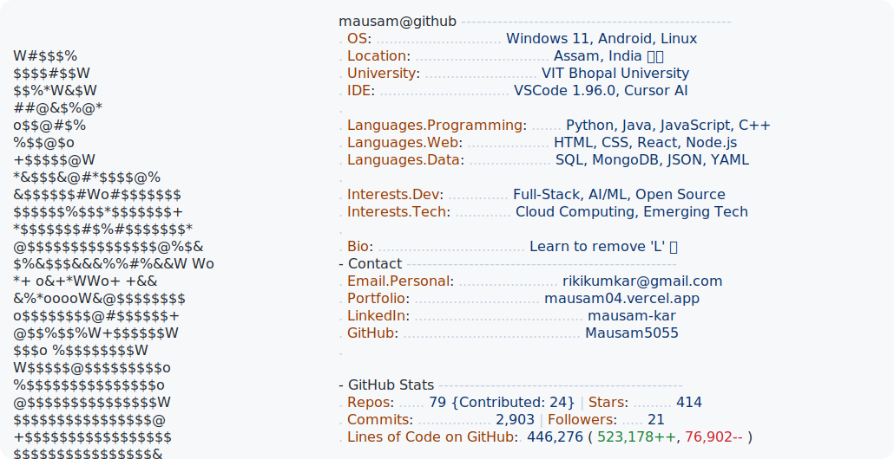

<a href="https://github.com/Mausam5055/Mausam5055">
  <picture>
    <source media="(prefers-color-scheme: dark)" srcset="./dark_mode_v3.svg">
    
  </picture>
</a>

<!-- 🚀 What I Do — commented out, uncomment to restore
### 🚀 **What I Do**

  
| **Category** | **Details** |
|--------------|-------------|
| **🎯 Interests** | Software Development • AI/ML • Full-Stack Development |
| **📚 Learning** | Advanced Programming • Emerging Technologies • Cloud Computing |
| **🤝 Collaboration** | Open-Source Projects • Innovative Solutions • Tech Communities |
| **📧 Contact** | 📧 [rikikumkar@gmail.com](mailto:rikikumkar@gmail.com) |
| **🔗 LinkedIn** | [mausam-kar](https://www.linkedin.com/in/mausam-kar-6388861a7/) |
| **🌍 Portfolio** | [mausam03.vercel.app](https://mausam04.vercel.app/) |
| **🏷️ Pronouns** | He/Him |
| **⚡ Fun Fact** | Always exploring new technologies and building cool projects! |

-->

## 💀 Skills &amp; Stacks

| &nbsp;&nbsp;&nbsp;&nbsp;&nbsp;&nbsp;&nbsp;&nbsp; | &nbsp;&nbsp;&nbsp;&nbsp;&nbsp;&nbsp;&nbsp;&nbsp; | &nbsp;&nbsp;&nbsp;&nbsp;&nbsp;&nbsp;&nbsp;&nbsp; | &nbsp;&nbsp;&nbsp;&nbsp;&nbsp;&nbsp;&nbsp;&nbsp; | &nbsp;&nbsp;&nbsp;&nbsp;&nbsp;&nbsp;&nbsp;&nbsp; | &nbsp;&nbsp;&nbsp;&nbsp;&nbsp;&nbsp;&nbsp;&nbsp; | &nbsp;&nbsp;&nbsp;&nbsp;&nbsp;&nbsp;&nbsp;&nbsp; | &nbsp;&nbsp;&nbsp;&nbsp;&nbsp;&nbsp;&nbsp;&nbsp; | &nbsp;&nbsp;&nbsp;&nbsp;&nbsp;&nbsp;&nbsp;&nbsp; | &nbsp;&nbsp;&nbsp;&nbsp;&nbsp;&nbsp;&nbsp;&nbsp; |
|:---:|:---:|:---:|:---:|:---:|:---:|:---:|:---:|:---:|:---:|
|  |  |  |  |  |  |  |  |  |  |
|  |  |  |  |  |  |  |  |  |  |
|  |  |  |  |  |  |  |  |  |  |
|  |  |  |  |  |  |  |  |  |  |
|  |  |  |  |  |  |  |  |  |  |
|  |  |  |  |  |  |  |  |  |  |

> *Yes... I'm pretty comfortable with every language and tool on this list.*

 

### 🎨 **Connect With Me**

| | | | |
|:---:|:---:|:---:|:---:|
|  |  |  |  |

# 📊 GitHub Stats:

 
  

  

###

## 🏆 GitHub Trophies

### 🔝 Top Contributed Repo

### ✍️ Random Dev Quote
 

<!-- Snake animation - generated by GitHub Actions -->

