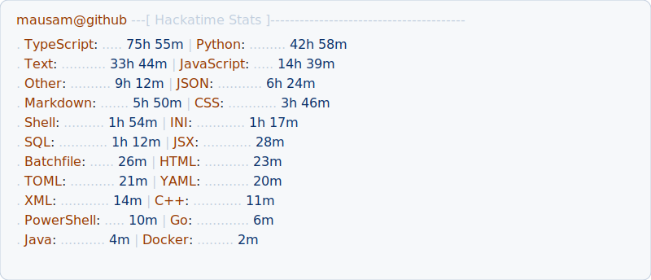
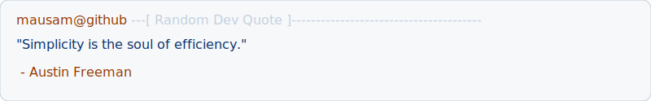

imes arwe not shown ...fix

i

  

 

<a href="https://github.com/Mausam5055/Mausam5055">
  <picture>
    <source media="(prefers-color-scheme: dark)" srcset="./dark_mode_v5.svg">
    
  </picture>
</a>

<!-- 🚀 What I Do — commented out, uncomment to restore
### 🚀 **What I Do**

  
| **Category** | **Details** |
|--------------|-------------|
| **🎯 Interests** | Software Development • AI/ML • Full-Stack Development |
| **📚 Learning** | Advanced Programming • Emerging Technologies • Cloud Computing |
| **🤝 Collaboration** | Open-Source Projects • Innovative Solutions • Tech Communities |
| **📧 Contact** | 📧 [rikikumkar@gmail.com](mailto:rikikumkar@gmail.com) |
| **🔗 LinkedIn** | [mausam-kar](https://www.linkedin.com/in/mausam-kar-6388861a7/) |
| **🌍 Portfolio** | [mausam03.vercel.app](https://mausam04.vercel.app/) |
| **🏷️ Pronouns** | He/Him |
| **⚡ Fun Fact** | Always exploring new technologies and building cool projects! |

-->

## 💀 Skills &amp; Stacks

 

### 📂 Top Projects

<table align="center" style="border: none;">
  <tr>
    <td width="300" valign="top">
      
    </td>
    <td width="800" valign="top">
      <picture>
        <source media="(prefers-color-scheme: dark)" srcset="./projects_dark_v1.svg?v=2">
        
      </picture>
    </td>
  </tr>
</table>

### ⏱️ Hackatime Stats

  <picture>
    <source media="(prefers-color-scheme: dark)" srcset="./hackatime_dark_v1.svg">
    
  </picture>

### 📈 3D Contribution Graph

  <picture>
    <source media="(prefers-color-scheme: dark)" srcset="./profile-3d-contrib/profile-night-rainbow.svg?v=4">
    
  </picture>

### 🎨 **Connect With Me**

### ✍️ Random Dev Quote

  <picture>
    <source media="(prefers-color-scheme: dark)" srcset="./quote_dark_v1.svg">
    
  </picture>

<!-- Snake animation - generated by GitHub Actions -->

