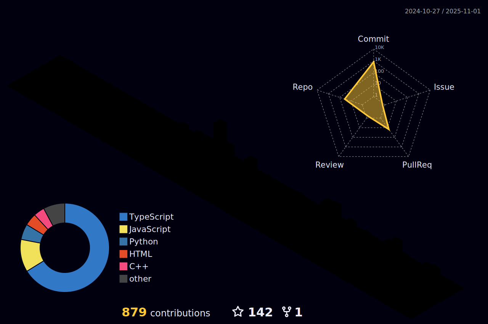

 

### 🎯 **About Me**

### 👋 **Hello World! I'm Mausam Kar**  
@Mausam5055

 

### 🚀 **What I Do**

  
| **Category** | **Details** |
|--------------|-------------|
| **🎯 Interests** | Software Development • AI/ML • Full-Stack Development |
| **📚 Learning** | Advanced Programming • Emerging Technologies • Cloud Computing |
| **🤝 Collaboration** | Open-Source Projects • Innovative Solutions • Tech Communities |
| **📧 Contact** | 📧 [rikikumkar@gmail.com](mailto:rikikumkar@gmail.com) |
| **🔗 LinkedIn** | [mausam-kar](https://www.linkedin.com/in/mausam-kar-6388861a7/) |
| **🌍 Portfolio** | [mausam03.vercel.app](https://mausam03.vercel.app/) |
| **🏷️ Pronouns** | He/Him |
| **⚡ Fun Fact** | Always exploring new technologies and building cool projects! |

 

### 🎨 **Connect With Me**

  

 

 

## 🏆 GitHub Trophies

<h3 align="left">Connect with me:</h3>

<h3 align="left">Languages and Tools:</h3>

# 📊 GitHub Stats:

 
  

  

###

### 🔝 Top Contributed Repo

## 🌐 Socials:
   

# 💻 Tech Stack:
           

# 📈 LeetCode Stats :

### ✍️ Random Dev Quote
 

<!-- Snake animation - generated by GitHub Actions -->

